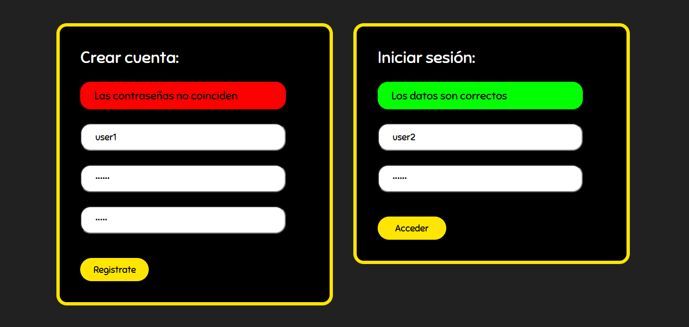
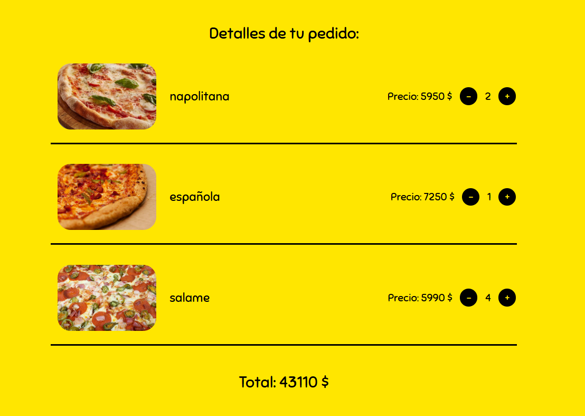

# Pizzeria Website
This project is a static page for a pizzeria, built using React to manage the various components of the interface.

# Description
The page has the following sections:

- **Navbar**:
  - A "Home" button.
  - A "Total" button (currently a placeholder).
  - "Login" and "Register" buttons if the user is not logged in, "Profile" and "Logout" buttons if the user is logged in.
- **Main Section**: Includes a header and a section showing the products.
- **Cart Section**: The user can see the items added to the cart (currently only placeholder items are shown). Each item in the cart displays the product details (image, name, price), along with buttons to increase or decrease the quantity of the item. The total section at the bottom of the cart dynamically calculates and displays the total price based on the prices and quantities of the items in the cart.
- **Forms Section**: Two forms, one for creating an account and one for logging in.
- **Footer**

# Preview
## Home

## Forms

## Cart

